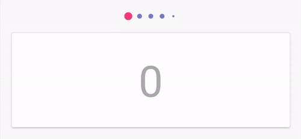

[![Maven Central][img version shield]][maven]

ScrollingPagerIndicator
=======================
Pager indicator inspired by Instagram. Lightweight and easy to set up.



#### Getting started
1. Add dependency to Gradle script:
```Groovy
implementation "ru.tinkoff.scrollingpagerindicator:scrollingpagerindicator:x.x.x"
```
If you are going to use ```android.support.v4.view.ViewPager```, you must have one of those dependencies:
```
implementation "com.android.support:support-core-ui:x.x.x"
```
or
```
implementation "com.android.support:appcompat-v7:x.x.x"
```
2. Add view to layout:
```xml
<android.support.v4.view.ViewPager
    android:id="@+id/pager"
    android:layout_width="match_parent"
    android:layout_height="wrap_content" />

<ru.tinkoff.library.ScrollingPagerIndicator
    android:id="@+id/indicator"
    android:layout_width="wrap_content"
    android:layout_height="wrap_content" />
```
3. Attach indicator to pager:
```java
ViewPager pager = findViewById(R.id.pager);
pager.setAdapter(new DemoPagerAdapter());
ScaledDotsIndicator indicator = findViewById(R.id.indicator);
indicator.attachToPager(pager);
```
#### Customization
| Attribute| Explanation| Default Value |
|-----------------------|-----------------------|--------|
| spi_dotSize| The diameter of a dot.| ```6dp```|
| spi_dotSelectedSize| The diameter of a currently selected dot.| ```10dp```|
| spi_dotColor     | The color of a dot. | ```@android:color/darker_gray```|
| spi_dotSelectedColor| The color of the currently selected dot.| ```@android:color/darker_gray```  |
| spi_dotSpacing      | The distance from center to center of each dot. | ```8dp```       |
| spi_visibleDotCount | The maximum number of dots which will be visible at the same time. If pager has more pages than visible_dot_count, indicator will scroll to show extra dots. Must be odd number.  | ```5```          |
| spi_looped | The mode for looped pagers support. You should make indicator looped if your custom pager is looped too. If pager has less items than ```spi_visibleDotCount```, indicator will work as usual; otherwise it will always be in infinite state. | ```false```|

#### Attach to custom pager
If you want to attach indicator to some custom pager, you have to implement ```ScrollingPagerIndicator.PagerAttacher``` interface.
You can take look at ```ru.tinkoff.scrollingpagerindicator.ViewPagerAttacher``` as implementation example.
And then you can attach your pager like this:
```java
indicator.attachToPager(pager, new ViewPagerAttacher());
```

#### TODO
1. Some extreme customizations may work incorrect.
2. There is no possibility to set fixed indicator width (because it's width is based on ```spi_visibleDotCount```).

#### License
```
Copyright 2018 Tinkoff Bank

Licensed under the Apache License, Version 2.0 (the "License");
you may not use this file except in compliance with the License.
You may obtain a copy of the License at

   http://www.apache.org/licenses/LICENSE-2.0

Unless required by applicable law or agreed to in writing, software
distributed under the License is distributed on an "AS IS" BASIS,
WITHOUT WARRANTIES OR CONDITIONS OF ANY KIND, either express or implied.
See the License for the specific language governing permissions and
limitations under the License.
```
[img version shield]: https://img.shields.io/maven-central/v/ru.tinkoff.scrollingpagerindicator/scrollingpagerindicator.svg?maxAge=3600
[maven]: https://search.maven.org/#search%7Cga%7C1%7Cg%3A%22ru.tinkoff.scrollingpagerindicator%22
